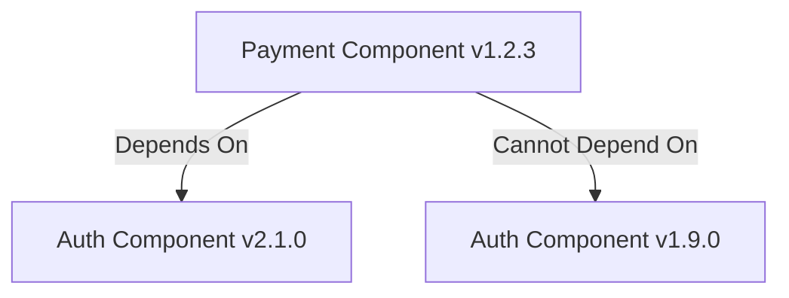
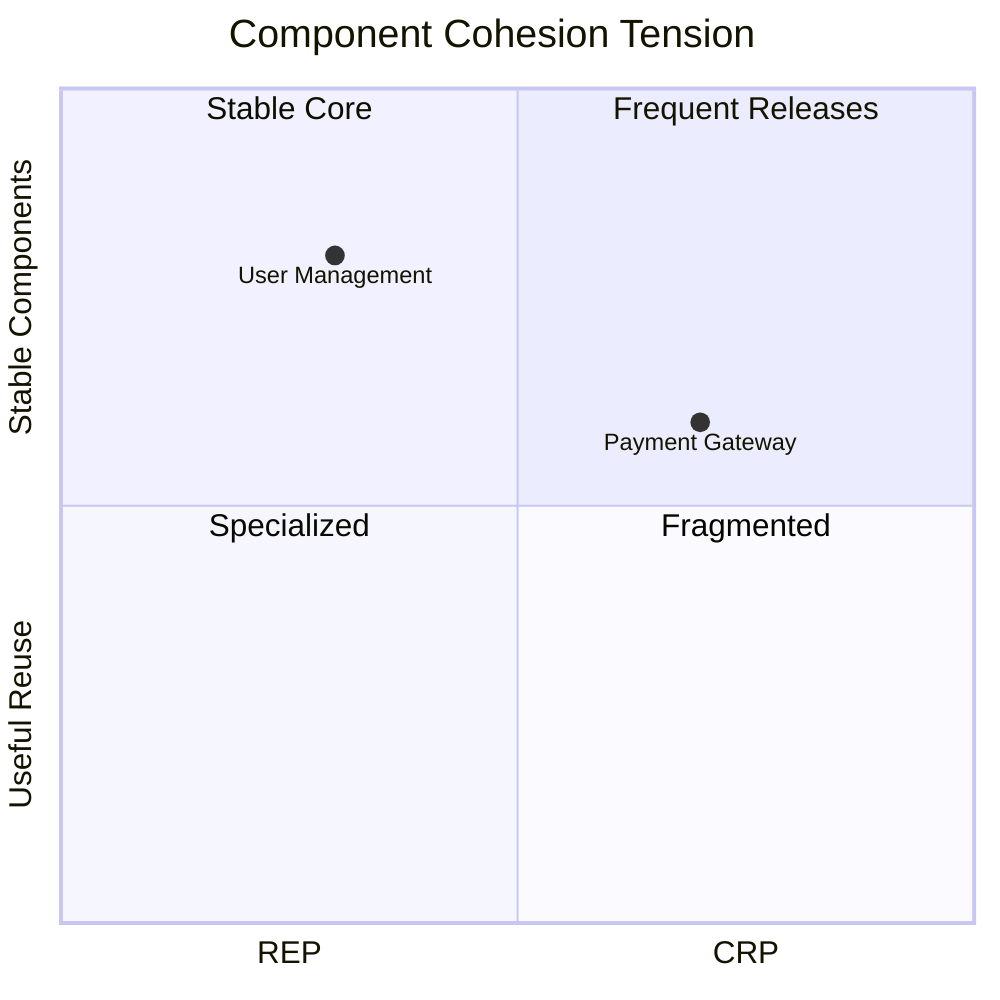

# Component Cohesion Principles

**"The forces that guide how we group classes into components"** — Robert C. Martin

## 🧩 The Three Cohesion Principles

### 1. Reuse/Release Equivalence Principle (REP)
**"The granule of reuse is the granule of release"**

#### Key Aspects:
- Components must have **version numbers**
- Shared classes must belong to **same release cycle**
- Maintain **backward compatibility**



### 2. Common Closure Principle (CCP)
**"Classes that change together belong together"**

#### Implementation Guide:
- Group classes by **change likelihood**
- Components should have **single change reason**
- Reduces **retesting/revalidation effort**

```
src/
└── shipping/
    ├── address-validator.ts  # All address-related changes
    ├── zipcode-service.ts
    └── shipping-cost.ts     # Ships with address changes
```

### 3. Common Reuse Principle (CRP)
**"Classes used together should be grouped together"**

#### Dependency Matrix:
| Scenario               | CRP Compliant? |
|------------------------|----------------|
| Client uses 3/5 classes | ❌             |
| Client uses 5/5 classes | ✅             |

## ⚖️ The Tension Diagram



## 🛠 Practical Application

### Versioning Strategy
```bash
# Semantic Versioning aligns with REP
MAJOR.MINOR.PATCH
^----- Compatible changes
^^---- New functionality
^^^--- Bug fixes
```

### Code Organization

```bash
// Anti-pattern: Low cohesion
components/
  ├── user/
  │   ├── login.ts
  │   └── invoice.ts  # Unrelated to user auth

// Compliant: High cohesion
components/
  ├── auth/           # CCP: All auth-related
  │   ├── login.ts
  │   └── session.ts
  ├── billing/        # REP: Versioned together
  │   ├── invoice.ts
  │   └── receipt.ts
```

## 📊 Cohesion Metrics

| Metric                  | Target Value |
|-------------------------|--------------|
| Component Change Frequency | <2 changes/release |
| Cross-Component Changes | <15% of total |
| Unused Class Ratio      | <5%          |

[Explore Coupling Principles →](./coupling.md)
