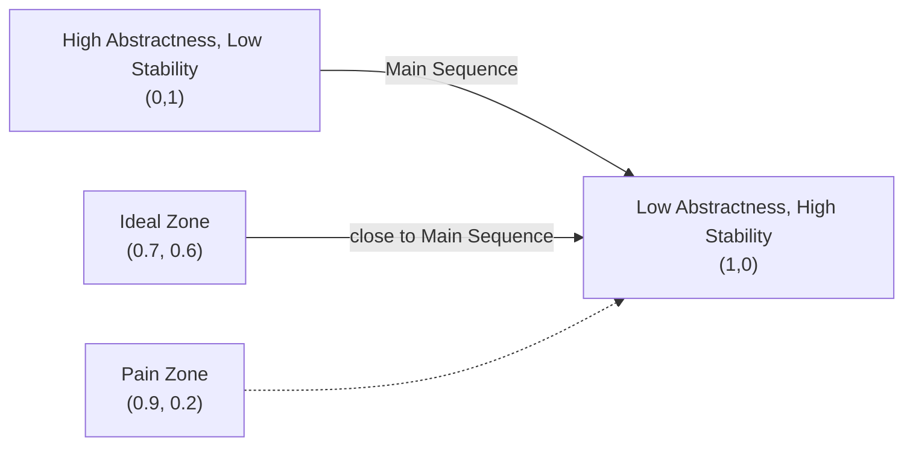

# Component Coupling Principles

**"The rules that govern relationships between components"** — Robert C. Martin

## 🔗 The Three Coupling Principles

### 1. Acyclic Dependencies Principle (ADP)
**"No cycles in the component dependency graph"**

#### Detection & Resolution:
```bash
# Use dependency analysis tools
npx madge --circular src/
```


**Solution**: Introduce `DIP` with interfaces

### 2. Stable Dependencies Principle (SDP)
**"Depend in the direction of stability"**

#### Stability Metrics:
```
I = Fan-in (incoming dependencies)
E = Fan-out (outgoing dependencies)
S = Stability = I / (I + E)  # Range: 0 (unstable) to 1 (stable)
```

| Component       | Fan-in | Fan-out | Stability |
|-----------------|--------|---------|-----------|
| Core Business   | 12     | 2       | 0.86      |
| UI Components   | 3      | 8       | 0.27      |

### 3. Stable Abstractions Principle (SAP)
**"Stable components should be abstract"**

#### Abstractness Metrics:
```
A = Abstractness = (#abstract classes/total classes)
```

**Maintain the "Main Sequence"**:


## 🏗 Architectural Patterns

### Dependency Management
```typescript
// High-level policy depends on abstraction
interface PaymentGateway {
  process(amount: number): Promise<Receipt>;
}

// Low-level detail implements it
class StripeAdapter implements PaymentGateway {
  async process(amount: number) {
    // Stripe-specific logic
  }
}
```

### Dependency Inversion in Action
```
src/
├── core/               # Stable, abstract
│   └── payment.ts      # interface PaymentGateway
└── infra/              # Less stable, concrete
    └── stripe.ts       # implements PaymentGateway
```

## 🛠 Tools for Coupling Control

1. **Dependency Visualization**:
   ```bash
   npx depcruise --output-type dot src | dot -T svg > deps.svg
   ```

2. **Circular Dependency Check**:
   ```bash
   npx dpdm src --circular --warning
   ```

3. **Abstractness Metrics**:
   ```bash
   npx typescript-coverage-report --abstractness
   ```

## 💡 Pro Tips

- **Weekly Coupling Reviews**: Check new dependencies in PRs
- **"Dependency Firewalls"**: Critical core components with strict SDP
- **Stability Budget**: No component >0.9 stability without abstraction

[Return to Principles Overview →](../design)
