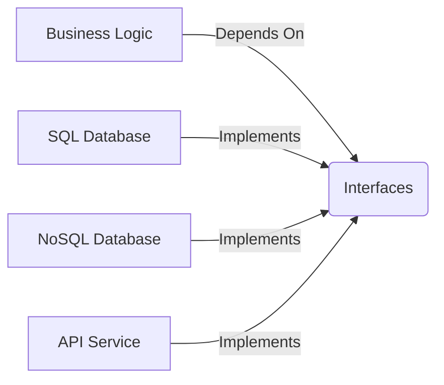

# Dependency Inversion Principle (DIP)

**"Depend on abstractions, not concretions"** — Robert C. Martin

## 🎯 Core Idea
High-level modules shouldn't depend on low-level modules. Both should depend on abstractions.

## 🔍 Deep Dive

### Problem DIP Solves
```typescript
// Anti-pattern: Violates DIP
class LightBulb {
  turnOn() { /* ... */ }
}

class Switch {
  constructor(private bulb: LightBulb) {}
  
  operate() {
    this.bulb.turnOn();
  }
}
```

### DIP-Compliant Solution
```typescript
interface Switchable {
  turnOn(): void;
  turnOff(): void;
}

class LightBulb implements Switchable {
  turnOn() { /* ... */ }
  turnOff() { /* ... */ }
}

class Switch {
  constructor(private device: Switchable) {}
  
  operate() {
    this.device.turnOn();
  }
}
```

## 🛠 Practical Implementation

### Dependency Injection Techniques
1. **Constructor Injection** (Most common)
2. **Property Injection**
3. **Method Injection**

### DIP Impact


## 🏗 Architectural Patterns
1. **Hexagonal Architecture**
2. **Onion Architecture**
3. **Clean Architecture**

## 💡 Pro Tips
- Apply the **Dependency Rule**: Source code dependencies must point inward
- Use **dependency injection containers** for complex systems
- Implement **dependency inversion metrics**:
  ```
  DIP Compliance = (Abstractions / Total Dependencies) * 100
  Target >85%
  ```

[Return to Principles Overview →](/docs/principles/design-principles)