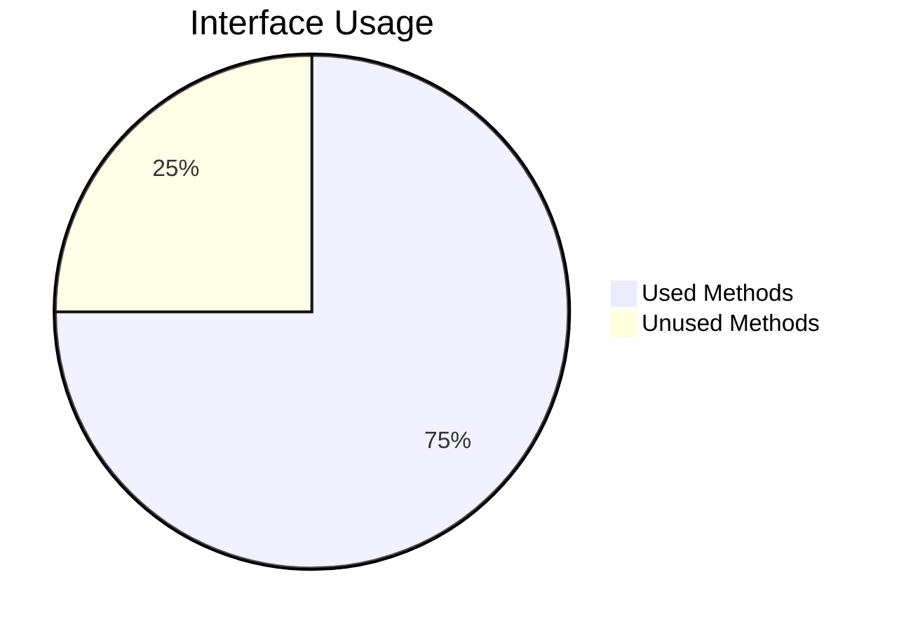

# Interface Segregation Principle (ISP)

**"Clients shouldn't be forced to depend on interfaces they don't use"** — Robert C. Martin

## 🎯 Core Idea
Many client-specific interfaces are better than one general-purpose interface.

## 🔍 Deep Dive

### Problem ISP Solves
```typescript
// Anti-pattern: "Fat" interface
interface Worker {
  work(): void;
  eat(): void;
  sleep(): void;
}

class Robot implements Worker {
  work() { /* OK */ }
  eat() { throw new Error("Robots don't eat!"); } // Forced implementation
  sleep() { throw new Error("Robots don't sleep!"); }
}
```

### ISP-Compliant Solution
```typescript
interface Workable {
  work(): void;
}

interface Eatable {
  eat(): void;
}

interface Sleepable {
  sleep(): void;
}

class Human implements Workable, Eatable, Sleepable {
  work() { /* ... */ }
  eat() { /* ... */ }
  sleep() { /* ... */ }
}

class Robot implements Workable {
  work() { /* ... */ }
}
```

## 🛠 Practical Implementation

### ISP Metrics


### Refactoring Patterns
1. **Interface Splitting**: Divide large interfaces
2. **Role Interfaces**: Create interfaces per client need
3. **Adapter Pattern**: Convert between interfaces

## 💡 Pro Tips
- Monitor **method throw implementations** - indicates unused capabilities
- Use **dependency analysis tools** to detect interface bloat
- Apply the **"Interface Segregation Score"**:
  ```
  ISS = (Used Methods / Total Methods) * 100
  Aim for >90% ISS
  ```

[Next Principle →](/docs/principles/design-principles/dip.md)