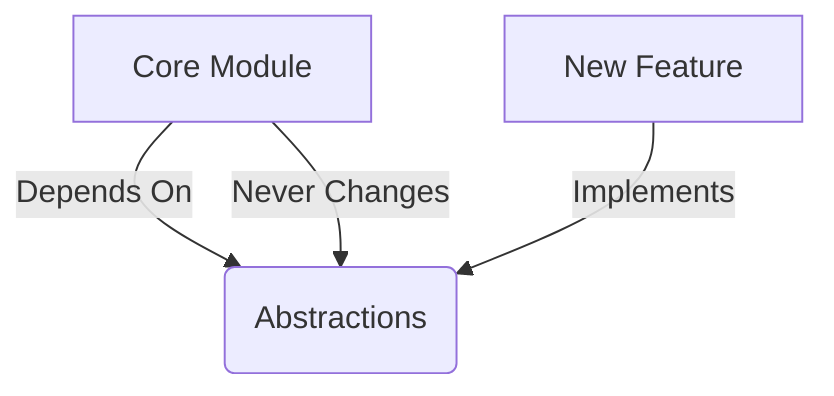

# Open/Closed Principle (OCP)

**"Software entities should be open for extension but closed for modification"** — Bertrand Meyer

## 🎯 Core Idea
Modules should allow new functionality to be added without changing existing source code.

## 🔍 Deep Dive

### Problem OCP Solves
```typescript
// Anti-pattern: Violates OCP
class Discount {
  giveDiscount(customerType: string) {
    if (customerType === "regular") return 0.1;
    if (customerType === "premium") return 0.2;
    throw new Error("Invalid type");
  }
}
```

### OCP-Compliant Solution
```typescript
interface Customer {
  getDiscount(): number;
}

class RegularCustomer implements Customer {
  getDiscount() { return 0.1; }
}

class PremiumCustomer implements Customer {
  getDiscount() { return 0.2; }
}

class Discount {
  giveDiscount(customer: Customer) {
    return customer.getDiscount();
  }
}
```

## 🛠 Practical Implementation

### Implementation Patterns
1. **Strategy Pattern**: Encapsulate interchangeable behaviors
2. **Decorator Pattern**: Add responsibilities dynamically
3. **Template Method**: Define algorithm skeleton

### OCP Metrics


## 🏗 Architectural Impact
- **Plugin Architectures**: Systems like VS Code thrive on OCP
- **Framework Design**: Spring, Angular core principles
- **Microservices**: Service interfaces remain stable

## 💡 Pro Tips
- Apply the **"1000-foot rule"**: Core logic shouldn't change when adding features
- Use **abstract base classes** for stable interfaces
- Implement **extension points** in critical modules

[Next Principle →](/docs/principles/design-principles/lsp.md)